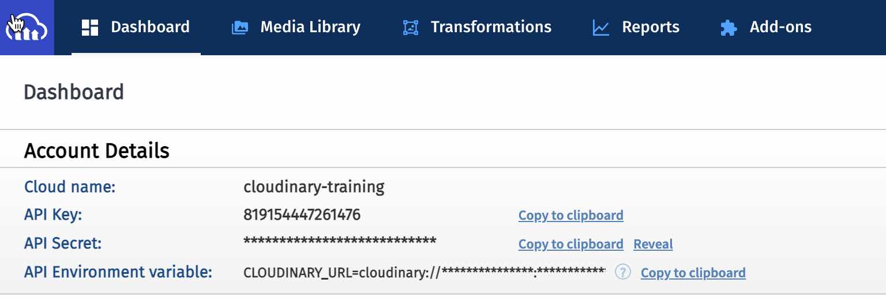

# Cloudinary Account

You can sign up for a free Cloudinary account [here](https://www.cloudinary.com/console).  Once you have an account, the link will take you to sign in.

Once you have signed up, you will need to know where to find your Credentials so that you can use the Node.js SDK to work with your media.

You'll find your credentials within the Dashboard tab of the console.

 Both Cloud name and API Key are public.  The **API Secret is private like a password** and therefore hidden.  Most often you want to copy the entire API Environment variable to your command line or SECRETS store, so you can click on "Copy to clipboard" to do that.

[Return to Setup](./)

