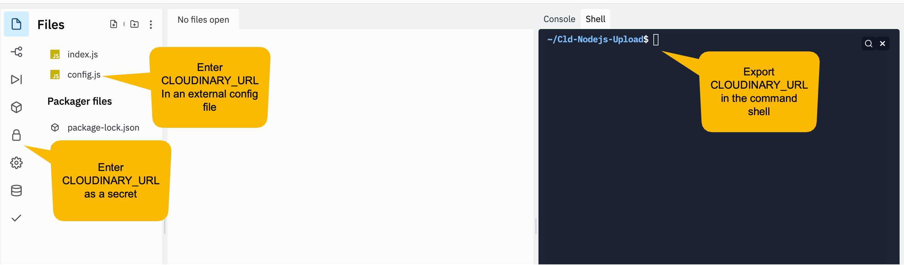

# REPL.IT Code Sandbox

This section helps you to see options for adding your Cloudinary credentials to the sandbox environment while maintaining security for your cloud account.

### Working in a Container

Repl.it uses [container technology](https://cloud.google.com/customers/repl-it) to provide a coding environment that provides an IDE implemented with the same [technology that powers Visual Studio Code](https://www.developer.com/cloud/repl-it-an-online-editor-for-coding-or-learning/#:~:text=This%20is%20the%20same%20technology,languages%20as%20well%20as%20collaboration.), a linux command shell and console.

We'll provide embedded code and links to serve as starters.  You need a free account on Repl.it to fork the code.  Examples that rely on the command line \(shell tab in repl.it UI\), can be executed within this document.

### Add Cloudinary Credentials to REPL.IT Sandbox

 We will need to supply Cloudinary Credentials in order to call functions with the Node.js SDK.  You need to make your credentials  available to the application in the code sandbox.  You can use **environment variables** to store your credentials ****or you can type our credentials into a **config file** and import the config file into your script.  If you include your credentials in a file, and you are using Git, be sure to add the file name to **.gitignore**.

The image below shows where to add your credentials in the REPL.IT sandbox.

[Using Credentials from the Command Line](using-credentials-on-the-command-line.md)

[Using Credentials from SECRET Store](using-credentials-in-secrets.md)

[Using Credentials in an External Config File](using-credentials-on-the-command-line.md)

\*\*\*\*[**Return to Node.js Setup**](../node-setup/)\*\*\*\*

